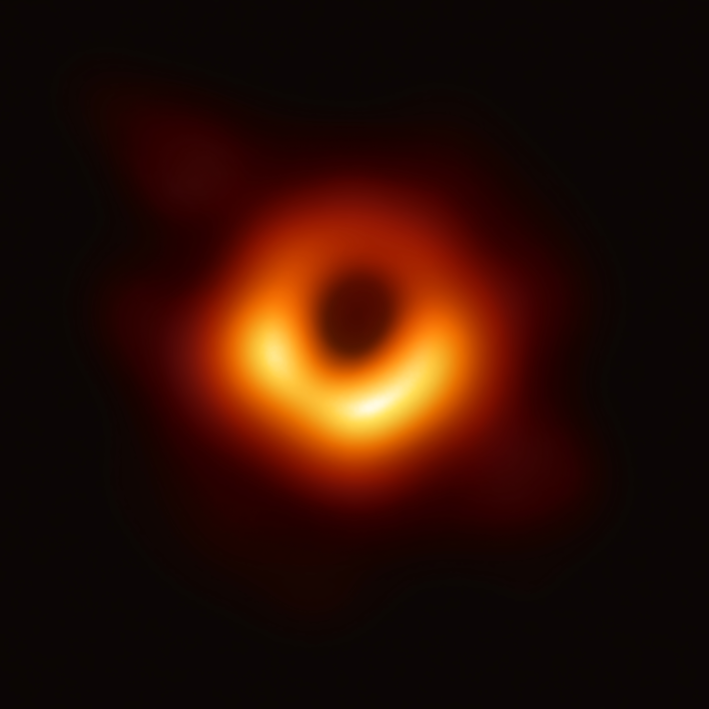

<div align="center">

```
        ████████████████
      ██░░░░░░░░░░░░░░░░██
    ██░░░░░░░░░░░░░░░░░░░░██
   █░░░░░░░░░░░░░░░░░░░░░░░░█
  █░░░░░░░░░░░░░░░░░░░░░░░░░░█
 █░░░░░░░░░░░░░░░░░░░░░░░░░░░░█
 █░░░░░░░░░░████████░░░░░░░░░░█
█░░░░░░░░███░░░░░░░░███░░░░░░░░█
█░░░░░░███░░░░░░░░░░░░░███░░░░░█
█░░░░░░█░░░░░░░░░░░░░░░░░█░░░░░█
█░░░░░░███░░░░░░░░░░░░░███░░░░░█
█░░░░░░░░███░░░░░░░░███░░░░░░░░█
 █░░░░░░░░░░████████░░░░░░░░░░█
 █░░░░░░░░░░░░░░░░░░░░░░░░░░░░█
  █░░░░░░░░░░░░░░░░░░░░░░░░░░█
   █░░░░░░░░░░░░░░░░░░░░░░░░█
    ██░░░░░░░░░░░░░░░░░░░░██
      ██░░░░░░░░░░░░░░░░██
        ████████████████
```

# just-blackhole

**A physically accurate Schwarzschild black hole simulation — written in Rust.**

Gravitational lensing. Accretion disk. Doppler beaming. Redshift. Real GR formulas. No shortcuts.

</div>

---

## Inspiration

The simulation is built to reproduce what real black holes look like — specifically, what *Gargantua* looked like in **Interstellar (2014)**. The physics team behind that film used actual numerical relativity. So do we.

Below is the real thing: the first photograph of a black hole ever taken, **Messier 87***, captured by the Event Horizon Telescope in 2019.

<div align="center">


*M87\* — 6.5 billion solar masses, 55 million light-years away. EHT Collaboration, 2019. [CC BY 4.0](https://creativecommons.org/licenses/by/4.0/)*
</div>

Same physics. Different renderer.

---

## What's implemented

| Feature | Formula / Method |
|---|---|
| Event horizon | `r < rs = 2GM/c²` → pure black |
| Null geodesics | `d²u/dφ² + u = (3/2)·rs·u²` integrated with RK4 |
| Impact parameter | `b = \|ray_origin × ray_dir\|` |
| Shadow boundary | `b_crit = (3√3/2)·rs` |
| Gravitational lensing | Deflection angle from full geodesic integration |
| Accretion disk | Temperature profile `T(r) = T_max·(r_inner/r)^(3/4)·(1 - √(r_inner/r))^(1/4)` |
| Doppler beaming | `D = 1 / (γ·(1 - β·cos(ψ)))`, intensity `∝ D⁴` |
| Gravitational redshift | `g = √(1 - rs/r)` per photon |
| Photon sphere glow | Rays with `b ≈ b_crit` orbit multiple times → thin bright ring |
| Secondary image | Rays deflected `> 90°` show the back of the disk bent over the shadow |
| HDR + Bloom | Threshold bloom + separable box blur + Reinhard tone mapping |

All formulas derived from the **Schwarzschild metric** in geometric units `G = c = 1`.

---

## Controls

| Input | Action |
|---|---|
| Left-click drag | Orbit camera (yaw + pitch) |
| Scroll wheel | Zoom in / out |
| `W` / `S` | Tilt camera up / down |
| `A` / `D` | Orbit camera left / right |
| `=` / `-` | Zoom in / out (keyboard) |
| `Esc` | Quit |

Stars rotate with the camera instantly. Disk and shadow update on mouse release.

---

## Build & run

Requires Rust (edition 2024) and Cargo.

```bash
git clone https://github.com/your-username/just-blackhole
cd just-blackhole
cargo run --release
```

`--release` matters here — the RK4 geodesic integrator runs per-pixel at startup, across 480,000 rays in parallel. Debug builds are noticeably slower.

---

## Stack

| Crate | Role |
|---|---|
| [`minifb`](https://github.com/emoon/rust_minifb) | Window + pixel buffer |
| [`rayon`](https://github.com/rayon-rs/rayon) | Parallel pixel processing |
| [`glam`](https://github.com/bitshifter/glam-rs) | Vec3 math |
| [`rand`](https://github.com/rust-random/rand) | Star field generation |

---

## How it works

Each pixel fires a ray from the camera. The ray's **impact parameter** `b` determines its fate:

- `b < b_crit` — the ray spirals into the event horizon → **black**
- `b ≈ b_crit` — the ray orbits the photon sphere → **bright ring**
- `b > b_crit` — the ray escapes, but bent. We integrate the geodesic ODE to find the total deflection angle, then check if the deflected ray intersects the accretion disk

This is all precomputed at camera setup. The render loop replays the result at 60fps with live disk animation (rotation, Doppler, time-varying brightness) layered on top.

---

## Learning project

This was built as a Rust learning project — writing the physics from scratch, understanding the math, and discovering the language through real problems.

No copy-paste solutions. Every formula derived, every bug debugged.

---

<div align="center">

*"Literally, we wanted to get it right."*
*— Kip Thorne, on the Interstellar black hole*

</div>
